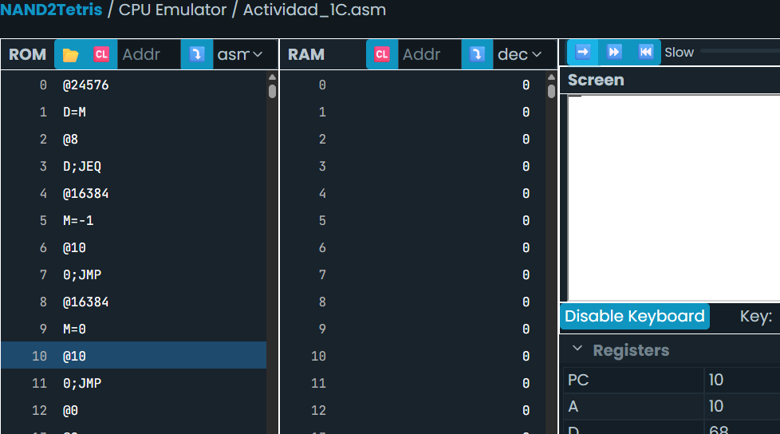
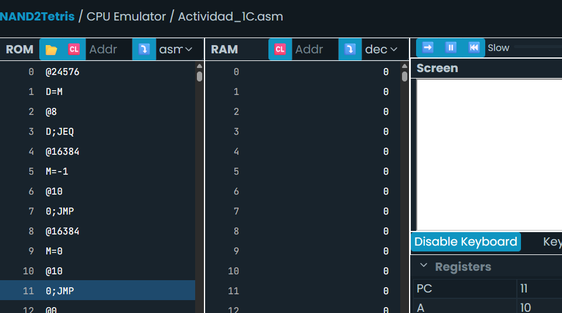

# Actividad 1

## A) ¿Qué es la entrada-salida mapeada a memoria?

La entrada-salida mapeada a memoria (Memory-Mapped I/O) es una técnica
de comunicación entre la CPU y los dispositivos periféricos en la que
ciertas posiciones de la memoria principal se asignan a registros de
control y datos de los dispositivos. De esta manera, la CPU puede
interactuar con los periféricos utilizando las mismas instrucciones de
lectura y escritura que se usan para acceder a la memoria normal. Esto
simplifica la arquitectura, ya que no requiere un conjunto de
instrucciones específicas para E/S, pero también puede generar
conflictos si no se administra correctamente el espacio de direcciones.

## B) ¿Cómo se implementa en la plataforma Hack?

La entrada-salida mapeada a memoria se implementa asignando direcciones
específicas de la RAM para controlar dispositivos como la pantalla y el
teclado.
- La **pantalla** está mapeada en el rango de direcciones de memoria
`16384` a `24575`. Cada bit de esta sección corresponde a un píxel de la
pantalla en blanco y negro (1 = negro, 0 = blanco).
- El **teclado** está mapeado en la dirección de memoria `24576`. Esta
dirección almacena el código ASCII de la tecla presionada, o `0` si
ninguna tecla está activa.

Este mecanismo permite que los programas escritos en la plataforma Hack
dibujen en pantalla o lean del teclado manipulando directamente las
posiciones de memoria asignadas.

## C) Inventa un programa que haga uso de la entrada-salida mapeada a memoria.
[Programa que llena los primeros valores de la pantalla](Actividad_1C.asm)

## D) Investiga el funcionamiento del programa con el simulador.

Adjunto estas 2 imágenes con el fin de mostrar el resultado, **¿Qué es lo que pasa?**, en el ejercicio que creé, se pinta la parte de arriba a la izquierda de la pantalla al presioanr la tecla "D", lo que pasa es que debe ser ejecutada paso a paso con la tecla "D" presionada para poder observarlo, esto debido a la ubicación del loop final, ya que al ejecutar el programa en "fast", no es posible leer la tecla "D", esto hace que el programa llegue al loop rápidamente.
______________________________________

# Actividad 3
[Código D](Actividad_3.asm)  

https://youtu.be/C42RgcUxf7Y

# Actividad 4
[Código D,E](Actividad_4.asm)  

https://youtu.be/HuMm0Z3GWyY

## Análisis del mapeado de teclado y E/S en Hack

Hice estas actividades en desorden, ya que me parecía mas entendible primer hacer la cuarta, ya que el mecanismo de dibujas y borrar al presionar una tecla es muy similar.

Cuando probé el primer código, me di cuenta de que el registro KBD (dirección 24576) funciona como una ventana directa al teclado. Si presiono una tecla, se guarda en memoria su valor ASCII; si no presiono nada, el valor es 0. En mi experimento, al presionar la tecla D (ASCII 68), el programa reconocía la condición y dibujaba la línea. Al presionar E (ASCII 69), la borraba.

El detalle es que el programa solo hacía esas acciones si presionaba una tecla en específico, y cuando soltaba todas las teclas (KBD = 0), no pasaba nada. Esto significa que la lógica del primer código solo reaccionaba a entradas exactas, pero no contemplaba el estado de “ninguna tecla presionada”.

## Análisis del mapeado de teclado y E/S en Hack

Cuando reorganicé el código para que primero verificara si la tecla era D, y en cualquier otro caso (incluido KBD = 0) saltara al bloque de borrar, el comportamiento cambió.

Ahora, si mantengo presionada la D, se dibuja la línea, pero en cuanto suelto la tecla, el KBD vuelve a 0 y automáticamente el flujo del programa entra en el bloque ERASE, borrando la línea. Es decir, aproveché el hecho de que KBD siempre refleja en memoria si hay o no hay tecla activa.

## Comparación entre códigos

*Actividad 4:* Solo respondía a D y E. Si no presionaba nada, la pantalla se quedaba en el último estado (dibujada o borrada) sin actualizar.

*Actividad 3:* La lógica cambió a “Dibuja si presiono D, borra si no”. Ahora el estado KBD = 0 tiene un efecto visible (se borra la línea), lo que genera una interacción más fluida.

En conclusión, lo que aprendí es que en Hack la memoria mapeada de entrada/salida depende totalmente del valor actual en los registros (KBD o SCREEN). La clave está en cómo diseño las comparaciones: darle prioridad a ciertas teclas, y usar el caso por defecto para representar la ausencia de entrada.