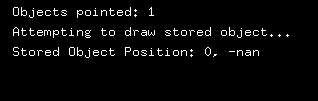
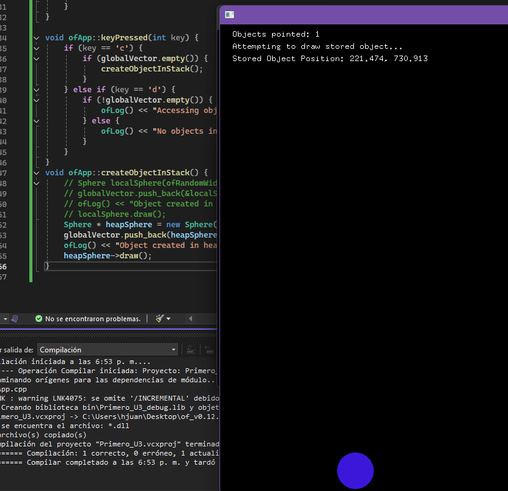

# Actividad 7     
- __¿Qué sucede cuando presionas la tecla “c”?(primer ejercicio)__  


- __¿Qué sucede cuando presionas la tecla “c”?(segundo ejercicio modificado)__  
 
Parece que funciona porque se dibuja una vez desde la función, pero enseguida el programa queda con un puntero inválido en el vector, provocando errores en los frames siguientes. Por lo que puede no dibujar nada, dibujar valores basura, o incluso crashear.  

Se ejecuta la función createObjectInStack(), que en realidad ahora crea un objeto en el heap con new Sphere(...).  

Ese puntero (heapSphere) se guarda dentro de globalVector.  

Se dibuja la esfera inmediatamente con heapSphere->draw().  

Y en los siguientes frames, cuando draw() recorre globalVector, la esfera sigue existiendo y se vuelve a dibujar  


- __¿Por qué ocurre esto?__  

Ahora, con new Sphere(...), el objeto está creado en el heap, donde la memoria permanece válida hasta que se libere manualmente con delete.  

Por eso el puntero guardado en globalVector sigue siendo válido, y el programa puede acceder al objeto y dibujarlo en cada frame.  

# [Actividad 8](https://youtu.be/bLm0z9OoWt8)  

Haciendo el ejercicio entendí mejor la diferencia. Cuando creé los objetos en el **heap**, usé `new` dentro de `setup()` o `keyPressed()`, y vi que esas bolas seguían existiendo en la memoria incluso después de salir de la función. Esto me enseñó que el heap es útil cuando necesito que un objeto dure más allá del ciclo de vida de la función que lo creó, como la lista de bolas que se van acumulando hasta que yo las elimine manualmente.  

En contraste, la bola creada en la **memoria global** estaba declarada al inicio del código, fuera de cualquier clase o función. Eso me mostró que la memoria global hace que el objeto exista desde que el programa empieza hasta que termina, siempre accesible en cualquier parte, como la bola fija que se dibujaba constantemente en pantalla.  

Por eso entendí que debo usar el heap cuando quiero flexibilidad y duración controlada, mientras que la memoria global la reservo para objetos permanentes que necesito todo el tiempo en el programa.  
[Actividad_8.cpp](Actividad_8.cpp)
[Actividad_8.h](Actividad_8.h)

# Actividad 9

Cuando se presiona la tecla f, el código entra en esta parte:  

```py  
if(!heapObjects.empty()) {
    delete heapObjects.back();   // Libera el último objeto del heap
    heapObjects.pop_back();      // Elimina el puntero del vector
}
```

- heapObjects.back() obtiene el último puntero almacenado en el vector.  
- delete heapObjects.back(); libera la memoria en el heap.  
- heapObjects.pop_back(); borra el puntero del vector para que no quede apuntando a memoria inválida.  

__Por ende:__  
Cuando se presiona f, se elimina el último círculo dibujado en pantalla, porque la memoria que ocupaba ese ofVec2f en el heap es liberada, y el puntero desaparece del vector, por lo que ya no hay nada que dibujar en esa posición.


## Análisis de:  
```py 
if(!heapObjects.empty()) {
    delete heapObjects.back();
    heapObjects.pop_back();
}
```  
- El bloque elimina el último objeto del heap y luego quita su puntero del vector, de forma correcta y en orden seguro.  

- Evita accesos inválidos comprobando empty().  
