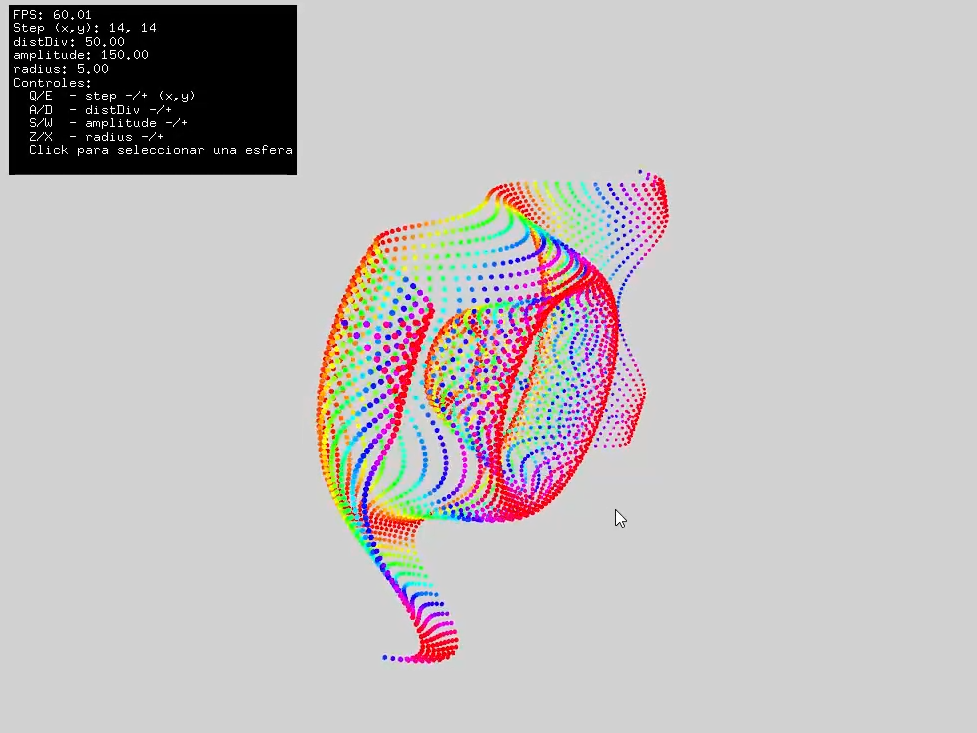

## Gestión de Memoria (Stack vs. Heap) 

* **Heap (Memoria Principal):** La mayor parte de los datos, como el `std::vector` que contiene todas las esferas, se almacena en el **Heap**. Esta es una memoria grande y flexible que persiste mientras tu aplicación está en ejecución. Es ideal para almacenar colecciones de objetos o datos cuyo tamaño puede cambiar.

* **Stack (Memoria Rápida):** Las variables locales dentro de las funciones (por ejemplo, las que se usan para calcular la intersección del rayo) se crean en el **Stack**. Es una memoria muy rápida pero temporal; los datos que contiene se destruyen automáticamente cuando la función termina.

En resumen: los datos grandes y persistentes van al **Heap**; los datos pequeños y temporales van al **Stack**.

---

### ## Conceptos Básicos de Programación Gráfica 💡

1.  **El Ciclo de la Aplicación:** Aprendiste el "corazón" de toda aplicación gráfica o de videojuego:
    * **`setup()`:** Se ejecuta **una vez** para inicializar todo.
    * **`update()`:** Se ejecuta en **cada fotograma** para actualizar la lógica (mover cosas, calcular animaciones).
    * **`draw()`:** Se ejecuta en **cada fotograma** (justo después de `update`) para dibujar el estado actual en la pantalla.

2.  **Organización de Datos:** Viste que agrupar variables relacionadas en `structs` (como `Sphere` y `GridParams`) hace el código mucho más limpio y fácil de entender que tener muchas variables sueltas.

3.  **Transformación de Coordenadas:** La función de *raycasting* te enseñó un concepto clave: cómo traducir una acción en un espacio 2D (el clic del mouse en la pantalla) a un concepto en un espacio 3D (un rayo que viaja por el mundo virtual) para poder interactuar con los objetos.

