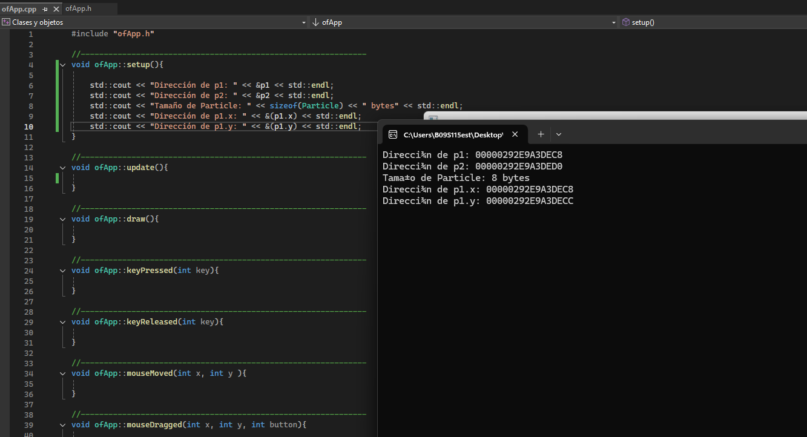

### 1) La clase puede representar una particula en una posición (x,y), que cambia srgún los valores que se le den a (dx,dy), el cual puede ser edpecíficado en una función en el cpp, por lo cual podría seguir el mouse o responder a un evento.

### 2) los atributos (x y y): Guardan el estado de cada objeto Particle. En este caso representan la posición en un plano 2D.

Método (move):Usa y modifica esos atributos. Cuando se llama a move(dx, dy), el método suma los valores dx y dy a la posición actual (x, y).

NOTA(una clase es el lugar donde se definen los atributos que va a tener un objeto, los objetos son instancias creadas con los atributos de esa clase, por lo que los métodos, segun como se usen, modificaran el resultadod del objeto)

Respuesta del prompt: Un objeto en C++ es una instancia en memoria creada a partir de una clase (la plantilla). Los atributos guardan el estado del objeto y los métodos son las operaciones que pueden leer o modificar ese estado. En tu Particle, llamar a move cambia los atributos x y y del objeto que llamó al método (a través de this).

EXPLORACIÓN:

Particle(Clase) p1(objeto);
Particle(Clase) p2(objeto);

Basandonos en los resultados, tener en cuenta que cada objeto utiliza el peso que sumen sus atributos, en este caso los flotantes, cada uno ocupa 4 bytes.

### 1) ¿Los atributos están almacenados de forma contigua?

Sí. En Particle, los atributos x y y son float de 4 bytes cada uno y se guardan uno seguido del otro, en el orden declarado. Los métodos no ocupan espacio en cada objeto, solo los atributos. Por eso la dirección de y está justo 4 bytes después de la de x.

### 2) ¿Qué indica el tamaño del objeto sobre su estructura interna?

El sizeof(Particle) refleja la suma de los atributos más cualquier posible relleno (padding) para alineación. En este caso son 8 bytes exactos (4 + 4) porque ambos atributos son float y no requieren padding adicional.

Respuesta del prompt:

* **Almacenamiento:** Un objeto es un bloque de memoria con sus atributos; los métodos no ocupan espacio en él.
* **Dos instancias:** Cada objeto tiene su propio bloque; `p1` y `p2` no necesariamente están juntos, aunque en la pila suelen estar uno tras otro.
* **Atributos:** Dentro de un objeto sí están contiguos y en el orden declarado (`x` seguido de `y`).
