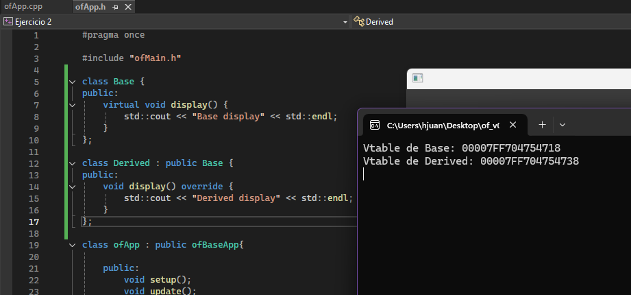

## Ejercicio 1

En este primer ejercicio trabajé con **polimorfismo y tablas virtuales (vtable)**.  
Definí una clase `Base` con un método virtual `display()` y una clase `Derived` que sobreescribe este método. Luego, dentro de la función `setup()` probé cómo se comportan los objetos al imprimir la dirección de su vtable.

```cpp
class Base {
public:
    virtual void display() {
        std::cout << "Base display" << std::endl;
    }
};

class Derived : public Base {
public:
    void display() override {
        std::cout << "Derived display" << std::endl;
    }
};
```

```cpp
void ofApp::setup() {
    Base b;
    Derived d;

    std::cout << "Vtable de Base: " << *(void**)&b << std::endl;
    std::cout << "Vtable de Derived: " << *(void**)&d << std::endl;
}
```

Con este ejemplo confirmé que cada clase que tiene funciones virtuales contiene una tabla de direcciones (vtable) que apunta a la implementación correcta del método en tiempo de ejecución.

---

## Ejercicio 2

En el segundo ejercicio trabajé con los **modificadores de acceso en C++**: `private`, `protected` y `public`.  
Creé una clase llamada `AccessControl` para ejemplificar cómo funcionan las restricciones de acceso a los atributos.

```cpp
class AccessControl {
private:
    int privateVar;

protected:
    int protectedVar;

public:
    int publicVar;

    AccessControl() : privateVar(1), protectedVar(2), publicVar(3) {}
};
```

```cpp
int main() {
    AccessControl ac;

    ac.publicVar = 10; // Válido
    std::cout << "publicVar: " << ac.publicVar << std::endl;

    // ac.protectedVar = 20; // Error de compilación
    // ac.privateVar = 30;   // Error de compilación

    return 0;
}
```

Con este ejercicio comprobé que el compilador aplica las reglas de acceso en tiempo de compilación.  
El atributo público se puede modificar sin problema, mientras que el protegido y el privado generan error al intentar acceder desde fuera de la clase.

---

## Ejercicio 3

### ¿Cómo implementa el compilador el encapsulamiento?

El encapsulamiento en C++ es implementado por el compilador como una serie de reglas de acceso que se verifican en tiempo de compilación, no como una restricción en tiempo de ejecución.

Cuando compilo mi código, el compilador actúa como un "guardián de las reglas" del lenguaje. Al encontrar una línea como `ac.privateVar = 30;`, se da este proceso:

1. **Análisis de Contexto:** El compilador identifica que estoy tratando de acceder al miembro `privateVar` del objeto `ac`.  
2. **Verificación de Reglas:** Revisa el contrato de la clase `AccessControl` y ve que `privateVar` está en la sección `private`.  
3. **Aplicación de la Regla:** Como la regla `private` dice que solo la propia clase puede acceder a esa variable, y mi código está fuera de ella, se está violando la regla.  
4. **Acción:** El compilador detiene el proceso y genera un error de compilación. El programa ni siquiera llega a crearse como ejecutable.

En conclusión, el compilador se niega a traducir a lenguaje máquina cualquier instrucción que rompa el encapsulamiento definido en la clase.

---

### ¿Qué impide el acceso a los miembros privados?

Los miembros privados sí ocupan espacio en memoria dentro del objeto, junto con los públicos. La diferencia es que la barrera que los protege **no es física**, sino **lógica y abstracta**, impuesta por el compilador.

Lo que realmente impide el acceso es el sistema de tipos y nombres en C++.  
Fuera de la clase, el nombre `privateVar` simplemente no existe ni es visible. El compilador oculta ese "nombre" y prohíbe su uso.

En la memoria, el objeto sigue siendo un bloque de bytes contiguos. Un programador avanzado podría usar punteros para calcular la dirección y acceder a la variable privada, pero eso rompe por completo el contrato de la clase, genera comportamiento indefinido y es una pésima práctica.

---
