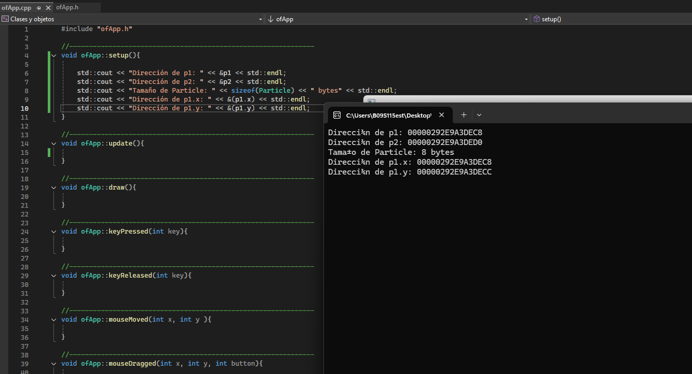

### 1) La clase puede representar una particula en una posición (x,y), que cambia srgún los valores que se le den a (dx,dy), el cual puede ser edpecíficado en una función en el cpp, por lo cual podría seguir el mouse o responder a un evento.

### 2) los atributos (x y y): Guardan el estado de cada objeto Particle. En este caso representan la posición en un plano 2D.

Método (move):Usa y modifica esos atributos. Cuando se llama a move(dx, dy), el método suma los valores dx y dy a la posición actual (x, y).

NOTA(una clase es el lugar donde se definen los atributos que va a tener un objeto, los objetos son instancias creadas con los atributos de esa clase, por lo que los métodos, segun como se usen, modificaran el resultadod del objeto)

Respuesta del prompt: Un objeto en C++ es una instancia en memoria creada a partir de una clase (la plantilla). Los atributos guardan el estado del objeto y los métodos son las operaciones que pueden leer o modificar ese estado. En tu Particle, llamar a move cambia los atributos x y y del objeto que llamó al método (a través de this).

EXPLORACIÓN:

Particle(Clase) p1(objeto);
Particle(Clase) p2(objeto);

Basandonos en los resultados, tener en cuenta que cada objeto utiliza el peso que sumen sus atributos, en este caso los flotantes, cada uno ocupa 4 bytes.

### 3) ¿Los atributos están almacenados de forma contigua?

Sí. En Particle, los atributos x y y son float de 4 bytes cada uno y se guardan uno seguido del otro, en el orden declarado. Los métodos no ocupan espacio en cada objeto, solo los atributos. Por eso la dirección de y está justo 4 bytes después de la de x.

### 4) ¿Qué indica el tamaño del objeto sobre su estructura interna?

El sizeof(Particle) refleja la suma de los atributos más cualquier posible relleno (padding) para alineación. En este caso son 8 bytes exactos (4 + 4) porque ambos atributos son float y no requieren padding adicional.

Respuesta del prompt:

* **Almacenamiento:** Un objeto es un bloque de memoria con sus atributos; los métodos no ocupan espacio en él.
* **Dos instancias:** Cada objeto tiene su propio bloque; `p1` y `p2` no necesariamente están juntos, aunque en la pila suelen estar uno tras otro.
* **Atributos:** Dentro de un objeto sí están contiguos y en el orden declarado (`x` seguido de `y`).

### 5) ¿Qué diferencias hay entre datos estáticos y dinámicos en términos de memoria?

**Estáticos:**
- Una sola copia compartida entre todos los objetos.
- Residen en memoria global (segmento data).
- No ocupan espacio dentro de cada objeto.

**Dinámicos:**
- Cada objeto tiene un puntero (ese sí ocupa espacio en el objeto).
- El contenido real se reserva en el heap con new y no se refleja en el sizeof.
- Cada objeto puede gestionar su propia porción de memoria.

*Respuesta del prompt:* Una variable de clase declarada con static no pertenece a cada objeto, sino a la clase en sí. Se almacena una sola vez en memoria (en la sección data del programa), compartida por todas las instancias, por eso no afecta el sizeof(Clase) o no ocupa espacio dentro de cada objeto.

Resultado de experimento 1 y 2 para las respuestas anteriores:

### 6) ¿Qué es un objeto desde la perspectiva de la memoria?  
Un objeto en C++ es un bloque de memoria reservado según el sizeof de su clase.  
Ese bloque contiene los atributos (datos miembro no estáticos), ordenados como fueron declarados, más posibles bytes de padding para alineación.
Cada objeto tiene su propio bloque independiente, aunque provenga de la misma clase.  

### 7) ¿Cómo influyen los atributos y métodos en el tamaño y estructura del objeto?  
__Atributos (no estáticos):__  
- Sí influyen en el tamaño, porque se guardan dentro del objeto.  

__Métodos (normales):__  
- No influyen en el tamaño, porque el código está en la sección de instrucciones del programa y no se duplica por cada objeto.  

__Miembros estáticos:__  
- No influyen en el tamaño del objeto; existen una sola vez en memoria global. 

__Métodos virtuales:__  
- Cada objeto de una clase con al menos un método virtual guarda un puntero oculto a la vtable (vptr).  
- Ese puntero ocupa normalmente un void* (8 bytes en 64 bits), por lo que sí afecta el tamaño.  

### 8) Conclusiones:
- Un objeto es básicamente sus atributos en memoria (más posible vptr si hay virtuales).

- Los métodos no suman tamaño, salvo los virtuales que añaden un puntero interno.

- Los estáticos no cuentan dentro de cada objeto.

- Esto impacta el diseño:  
    - Usar muchos atributos grandes o punteros aumenta el tamaño de cada instancia.
    - Métodos virtuales añaden overhead de memoria (1 puntero por objeto) y de tiempo (llamada indirecta).
    - Variables estáticas son útiles para datos compartidos sin inflar cada instancia.